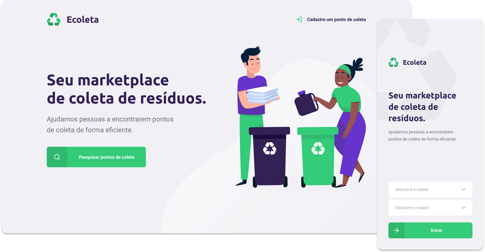

<p align="center">
  
	
  <p align="center">
  App made to help people to find garbage collection points and recycle!
  </p>
  <p align="center">
    
  </p>
</p>

<p align="center">
  

  

  

  <br>

  

  <a href="https://www.linkedin.com/in/mathpsantos/">
    
  </a>
</p>

 
# Index

- :rocket: [Project Summary](#rocket-project-summary)
- 👨‍💻️ [Technologies Used](#%EF%B8%8F-technologies-used)
- 📦️ [How to install the project](#%EF%B8%8F-how-to-install-the-project)
- 🤔️ [How can you contribute?](#%EF%B8%8F-how-can-you-contribute)
- 🔮 [Future Improvements](#-future-improvements)

---
## :rocket: Project Summary

This Project was in [Rocketseat's](https://rocketseat.com.br/) Next Leve Week crash course #1, with the objective to help people to find garbage collection points and recycle!

> Made only for learning purposes.
 
---
## 👨‍💻️ Technologies Used

This project was developed using the technologies bellow:

### Backend

  - [Node.js](https://nodejs.org/)
  
### Data Base

  - [SQLite3](https://www.sqlite.org/index.html)
  
### Frontend

  - [React JS](https://reactjs.org/)
  
### Mobile

  - [React Native](https://reactnative.dev/)
  
### Dependencies

  **Backend**
  - [Typescript](https://www.typescriptlang.org/)
  - [Cors](https://developer.mozilla.org/pt-BR/docs/Web/HTTP/Controle_Acesso_CORS)
  - [Express](https://expressjs.com/)
  - [Knex](http://knexjs.org/)
  - [Multer](https://github.com/expressjs/multer#readme)
  - [Celebrate](https://github.com/arb/celebrate#readme)

  **Frontend**
  - [Typescript](https://www.typescriptlang.org/)
  - [React Router DOM](https://reacttraining.com/react-router/)
  - [React Icons](https://react-icons.github.io/react-icons/)
  - [Axios](https://github.com/axios/axios)
  - [Leaflet](https://leafletjs.com/)
  - [React Leaflet](https://react-leaflet.js.org/)
  - [React Dropzone](https://github.com/react-dropzone/react-dropzone)

  **Mobile**
  - [Expo](https://expo.io/learn)
  - [Axios](https://github.com/axios/axios)
  - [React Native Maps](https://github.com/react-native-community/react-native-maps#readme)
  - [React Native SVG](https://github.com/react-native-community/react-native-svg)
  
### Code patterns

  - [ESLint](https://eslint.org/)

### IDE

  - [Visual Studio Code](https://code.visualstudio.com/)

---
 
## 📦️ How to install the project

> [Yarn](https://yarnpkg.com/) is required

To clone the project, use the commands bellow:

```bash
  # Clone the repository
  ❯ git clone https://github.com/MathPSantos/Ecoleta.git

  # Enter directory
  ❯ cd Ecoleta
```

### Backend

To install dependencies and initialize the project, you can use **Yarn** or **NPM**:

**Using yarn**

```bash
  # Enter backend directory
  > cd backend

  # Install the dependencies
  ❯ yarn 

  # Start the project
  ❯ yarn dev
```

### Frontend

To install dependencies and initialize the project, you can use **Yarn** or **NPM**:

**Using yarn**

```bash
  # Enter frontend directory
  > cd frontend

  # Install the dependencies
  ❯ yarn

  # Start the project
  ❯ yarn start
```

### Mobile

**This app use Expo.**

```bash
  # Enter mobile directory
  > cd mobile

  # Install the dependencies
  ❯ yarn
  
  # Install and start the project
  ❯ yarn start
```
---
 
## 🤔️ How can you contribute?

1. `fork` this repository
2. Create a branch with your feature:
   - `$ git checkout -b my_feature`
3. Commit your branch:
   - `$ git commit -m "feature: My new feature"`
4. Submit your branch:
   - `$ git push origin my_feature`
   
---
   
## 🔮 Future Improvements

### Backend
  - [ ] Finish CRUD Points
  - [ ] Create Custon Item
  - [ ] Add Test with [Jest](https://jestjs.io/)
  - [ ] Add Celebrate to all routes

### Frontend
  - [ ] Add window icon
  - [ ] Seperate components
  - [ ] Use [styled-components](https://styled-components.com/)
  - [ ] Add user
  - [ ] Add Login/Sing Up
  - [ ] Add Update, Read and Delete Points

### Mobile
  - [ ] Add launcher icon
  - [ ] Add Splash Screen
  - [ ] Add UF and City select
  
---

# License
[MIT License](/LICENSE)

<h4 align="center">
  Made with ❤️ by Matheus Pires Santos <a href="mailto:matheus.psantos2016@gmail.com">Get in touch!</a>
</h4>
  
